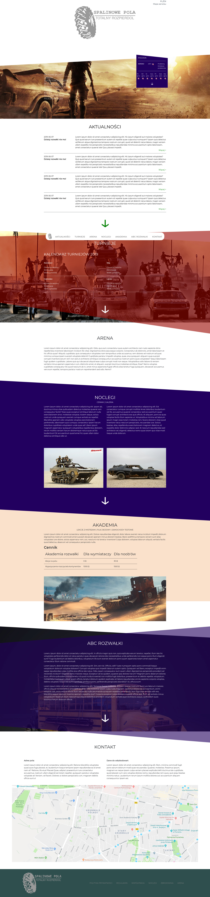

# Overview
Simple page cutup as an academic project.
The reference image has been provided by the lecturer.

The idea was to create all the HTML/JS/CSS files to reproduce the reference image as close as possible.

I've decided to change a bit the "subject" of the page, while leaving all the features similar.

## Result

<table>
<tr>
    <th style="text-align: center;">Reference</th>
    <th style="text-align: center;">Outcome</th>
</tr>
<tr>
    <td></td>
    <td></td>
</tr>
</table>

 